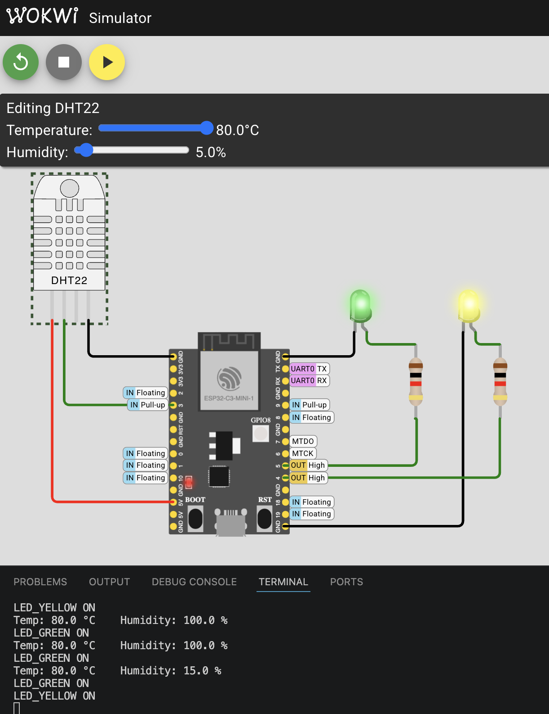

# Мониторинг температуры и влажности на ESP32

(IoT HW#1)

Проект считывает данные с датчика **DHT22** и зажигает светодиоды при выходе показателей за рамки нормы. Написан в **PlatformIO** (C++/Arduino).

## Схема подключения
* **DHT22** — `GPIO 3`
* **Желтый LED** (Влажность) — `GPIO 4` *(включается при < 40 %)*
* **Зеленый LED** (Температура) — `GPIO 5` *(включается при > 50 °C)*

## Как работает
Каждые 2 секунды плата опрашивает датчик, выводит показания в терминал и проверяет условия: если слишком жарко (>50 °C), загорается зеленый свет, если слишком сухо (<40 %), загорается желтый.

  

